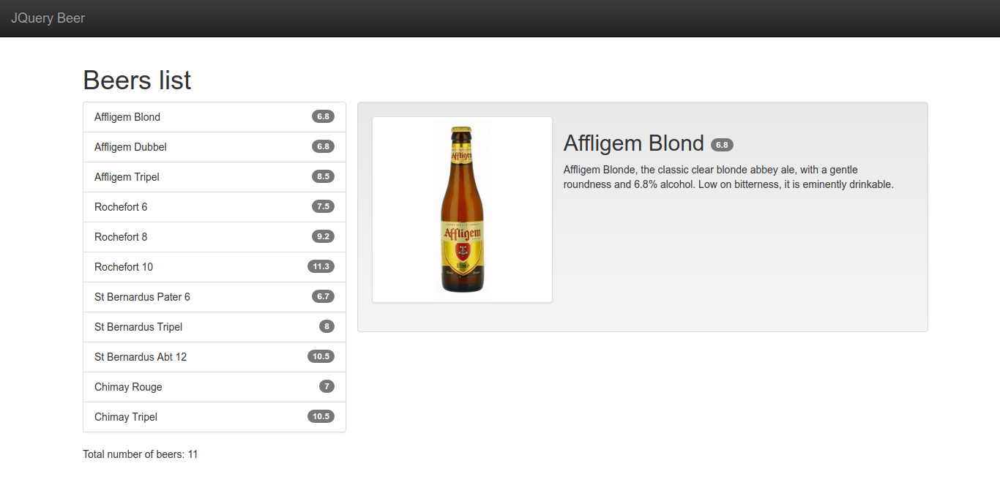

# TP2 : Liste des bières

Affichons la liste de nos bières de manière un peu plus dynamique. Pour celà nous avons une source de données dans `data/beers.json`


## Etape 1

Dans la page`index.html`, remplaçons :

```html
 <div class="col-md-4 col-sm-12">
    <ul class="list-group">
        <li class="list-group-item"><span class="badge">6.8</span> Affligem Blond</li>
        <li class="list-group-item"><span class="badge">8.5</span> Affligem Tripel</li>
    </ul>
    <p>Total number of beers: 2</p>
</div>
```

par :

```html
<div class="col-md-4 col-sm-12">
    <ul class="list-group" id="beersList"></ul>
</div>
```

Puis créer un fichier `js/beers.js` et l'insérer en fin de la page`index.html`.

## Etape 2 : `js/beers.js`

D'abord, il faut attendre que le DOM soit chargé, pour celà, nous utiliserons [$().ready()](http://api.jquery.com/ready/) :

```js
$( document ).ready(function() {
  // Handler for .ready() called.
});
```

Nous allons lire le contenu du fichier avec une requête [Ajax](http://api.jquery.com/jquery.get/) puis itérer sur chacun des items
avec `forEach`. Pour chacun de ces items, recréons :

```html
<li class="list-group-item"><span class="badge">6.8</span> Affligem Blond</li>
```

Pour rappel, un fichier Json est nativement parsé en javaScript.

```js
var data = [{a: 1, b: 2},{a:4, b:9}];
data[0].a;
```

Créons un élément `$('<li></li>')` dans lequel nous [ajouterons](http://api.jquery.com/category/manipulation/dom-insertion-inside/) le badge.

Nous pouvons chaîner les créations en y ajoutant les [classes CSS](http://api.jquery.com/addClass/).

Enfin [ajoutons](http://api.jquery.com/category/manipulation/dom-insertion-outside/) le nombre total d'item en créant un autre élément `$('<p></p>)`.



## Etape 3 : Aller plus loin

On peu ajouter un peu [d'animation](http://api.jquery.com/fadeIn/) à la création de la liste.

Ok, le fichier `index.js` risque de devenir monstrueux si l'application grossit. 
Modularisons avec le [TP3](../tp3).